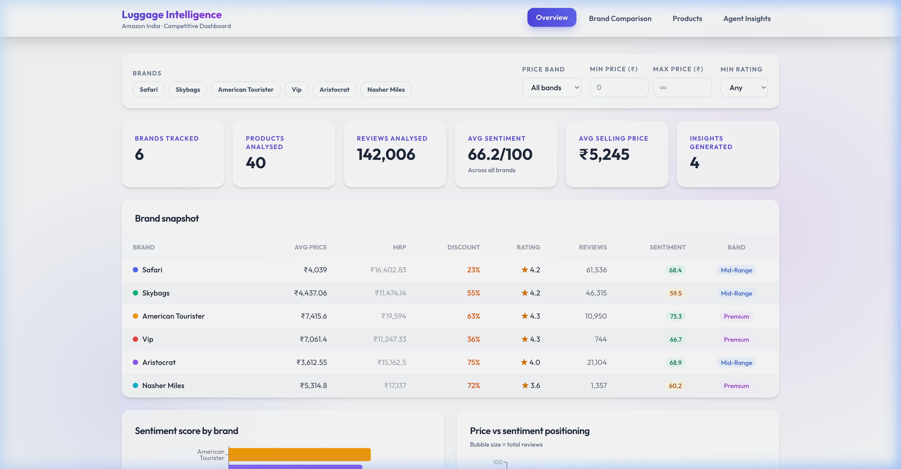
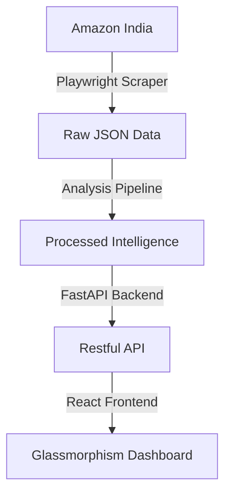

# 🌙 Moonshot: Luggage Intelligence Dashboard



Moonshot is a premium, real-time competitive intelligence platform designed to analyze the luggage market on Amazon India. It combines advanced web scraping with AI-driven sentiment analysis to provide a high-fidelity view of brand performance, customer satisfaction, and product positioning.


## ✨ Key Features

- **Automated Discovery**: Adaptive Serper-powered discovery layer to find products even when Amazon search is blocked.
- **Deep Sentiment Engine**: Dual-scoring system using **VADER** and **RoBERTa** (`cardiffnlp/twitter-roberta-base-sentiment`) for high-precision sentiment extraction.
- **Aspect-Level Analysis**: Granular analysis of customer feedback on specific product features (Wheels, Handles, Quality, etc.).
- **Premium Glassmorphism UI**: A stunning, modern interface built with **React**, **Tailwind CSS**, and **Framer Motion** equivalents for a slick, analytical experience.
- **Data Pipeline**: Automated processing that transitions raw scraped JSON into structured competitive insights.

## 🚀 Architecture



## 🛠️ Tech Stack

| Layer | Technology |
|-------|------------|
| **Frontend** | React, Recharts, Tailwind CSS (Glassmorphism) |
| **Backend** | FastAPI, Pydantic, Uvicorn |
| **Analysis** | pandas, NumPy, scikit-learn |
| **Scraping** | Playwright (Stealth), Serper.dev API, ScraperAPI |
| **NLP** | VADER, RoBERTa (HuggingFace Transformers) |

---

## 🏁 Getting Started

### 1. Prerequisites

- Python 3.10+
- Node.js 18+
- [Serper.dev](https://serper.dev/) API Key (for product discovery)

### 2. Installation

```bash
# Clone the repository
git clone https://github.com/shreyanshxt/Moonshot.git
cd Moonshot

# Setup Backend
python -m venv venv
source venv/bin/activate  # Mac/Linux
pip install -r requirements.txt
playwright install chromium

# Setup Frontend
cd frontend
npm install
```

### 3. Running the Pipeline

```bash
# 1. Scrape specific brand or all
python scraper/amazon_scraper.py --brand safari

# 2. Process data and generate insights
python analysis/pipeline.py

# 3. Start API
uvicorn api.main:app --reload --port 8000
```

### 4. Launching the Dashboard

```bash
cd frontend
npm run dev
```
Accessible at `http://localhost:5173`.

---

## 📊 Analytics Methodology

- **Sentiment Scoring**: Reviews are scored using a weighted average of RoBERTa confidence scores, normalized to a 0-100 scale.
- **Aspect Extraction**: We use KeyBERT to identify core product aspects and calculate sentiment for each individual feature, allowing brands to see exactly where they are winning or losing.
- **Competitive Positioning**: Real-time quadrant analysis mapping price against sentiment to identify market gaps.

---

## 🛡️ Stealth & Resilience

Amazon India employs aggressive anti-scraping measures. Moonshot bypasses these using:
- **Serper Discovery**: Using Google Search results to find product links without direct Amazon search interaction.
- **Stealth Browsers**: Playwright configured with custom fingerprinted user agents and behavioral patterns.
- **ScraperAPI Integration**: Support for residential proxies via ScraperAPI.

---

## 🔮 Future Roadmap

- [ ] **Anomaly Detection**: Flagging unnatural review patterns (velocity spikes).
- [ ] **Historical Price Tracking**: Cron-based price monitoring for discount strategy analysis.
- [ ] **Fine-tuned LLM**: Moving to an LLM-based summary engine for "Agent Insights".

---
*Created with ❤️ for Luggage Intelligence.*
